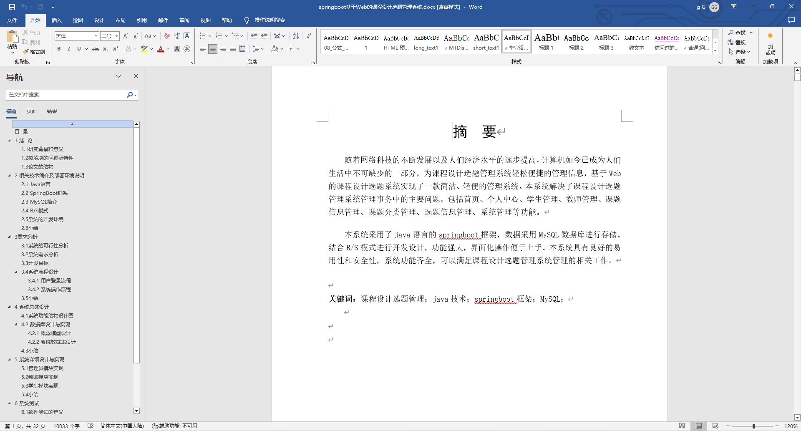
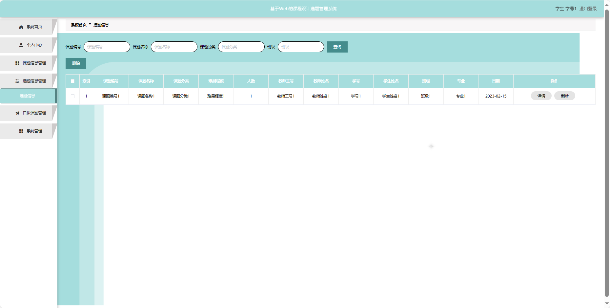
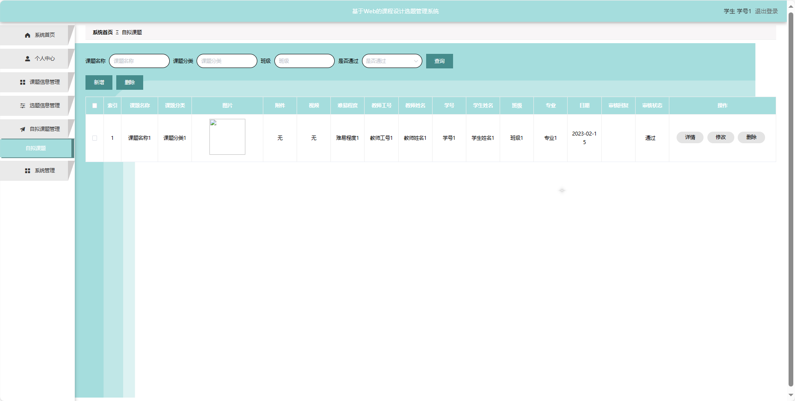
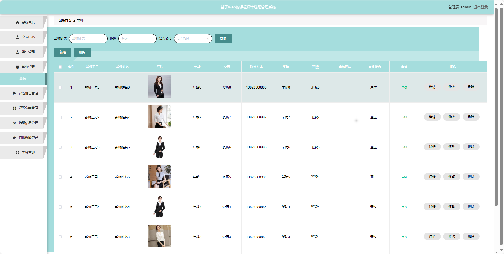
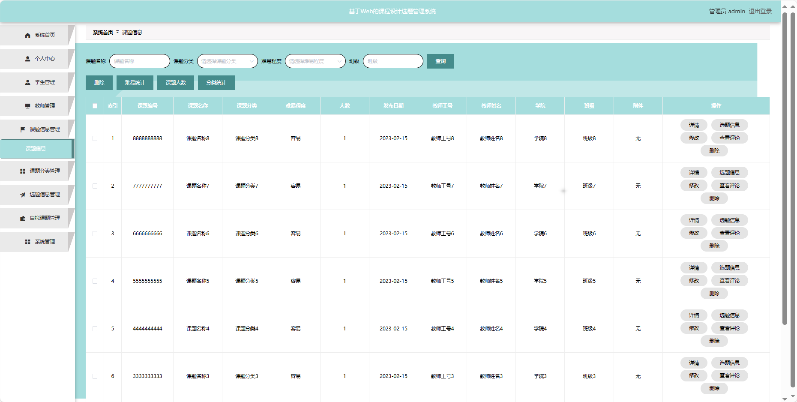
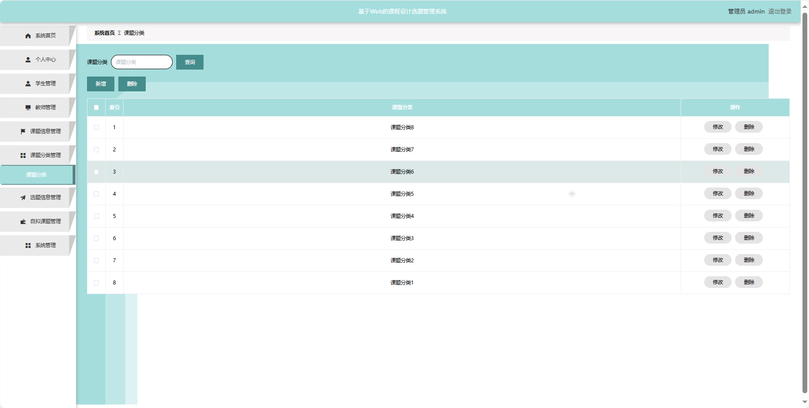
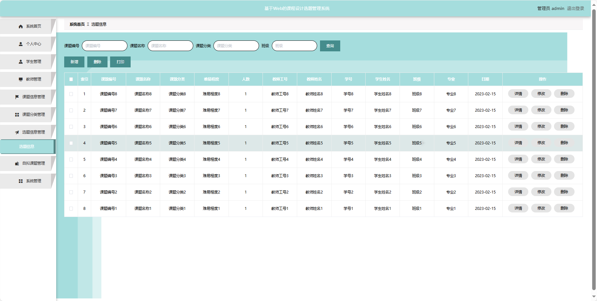
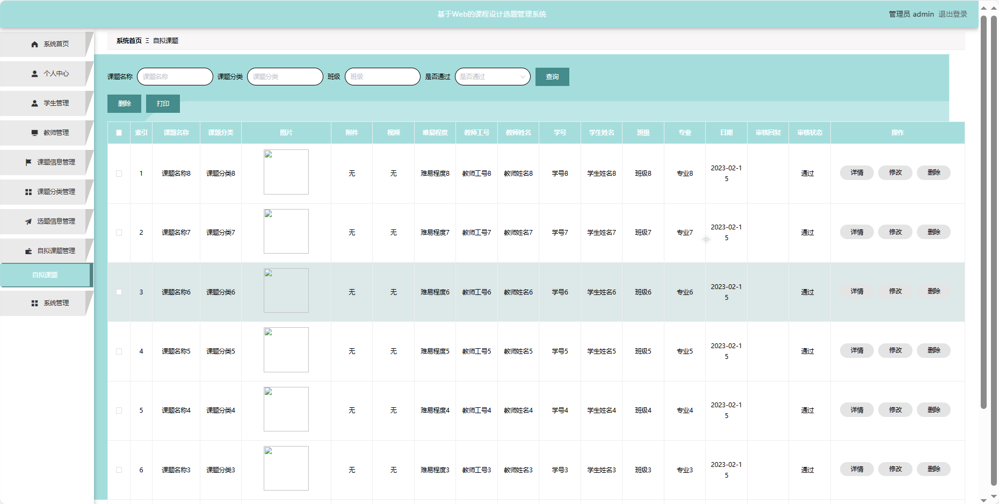
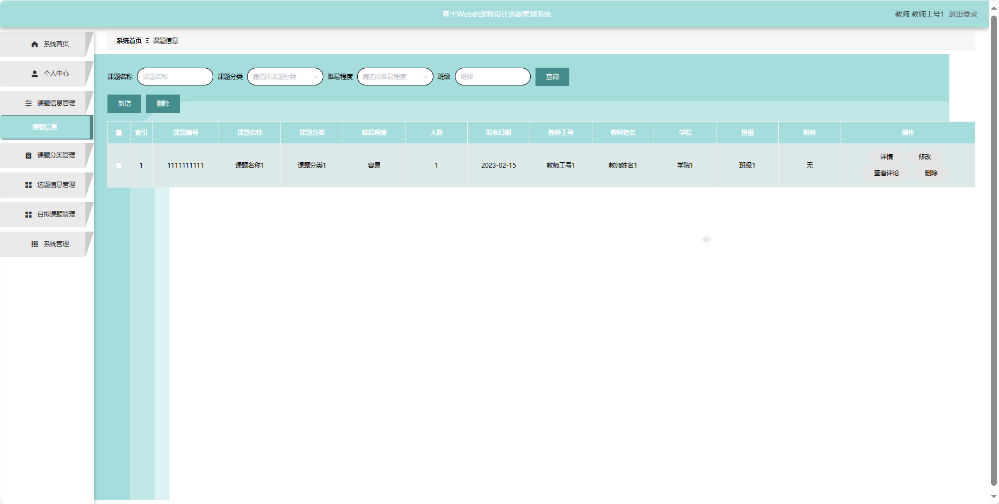

## 基于SpringBoot的课程设计选题管理系统(程序+报告)

###  获取sql数据库文件: 从戎源码网 (https://armycodes.com/) QQ: 386869957 QQ群: 377586148
###  所有系统地址: (https://github.com/YuLin-Coder/AllProjectCatalog) 
###  所有项目以及源代码本人均调试运行无问题 可支持远程安装部署调试、定制修改、代码讲解

## 项目介绍
基于SpringBoot的课程设计选题管理系统，系统包含三种角色：管理员、用户,教师主要功能如下。

### 【管理员】:
系统首页：查看系统整体概况。
个人中心：管理个人信息。
学生管理：审核和管理注册学生用户的信息。
教师管理：审核和管理注册教师用户的信息。
课题信息管理：监管和管理系统中的课题信息，包括发布、编辑、删除等。
课题分类管理：管理课题的分类信息。
选题信息管理：查看学生已选题目的情况，包括审批和管理选题流程。
自拟课题管理：审批和管理学生提出的自拟课题。
系统管理：管理系统的基本设置。

### 【教师功能】
系统首页：查看系统。
个人中心：管理个人信息。
课题信息管理：浏览已有的课题信息。
课题分类管理：管理课题的分类信息。
选题信息管理：查看学生已选题目的情况。
自拟课题管理：提出和管理个人自拟的课题。
系统管理：校园资讯管理。

### 【用户】:
系统首页：浏览课程设计选题管理系统的信息。
个人中心：管理个人信息，查看选题进展和历史记录。
课题信息管理：浏览已有的课题信息。
选题信息管理：查看已选择的选题信息。
自拟课题管理：提出和管理个人自拟的课题，。
系统管理：修改个人密码。

## 项目技术
- 编程语言：Java
- 数据库：MySQL
- 项目管理工具：Maven
- 前端技术：HTML、CSS、JavaScript、Jquery、Vue
- 后端技术：Spring、SpringMVC、MyBatis

## 运行环境
- JDK版本：JDK1.8及以上
- 开发工具：IDEA、Ecplise、Myecplise都可以
- 数据库: MySQL5.7及以上
- Maven：maven3.0及以上
- Node：14.14.0及以上

## 运行截图

